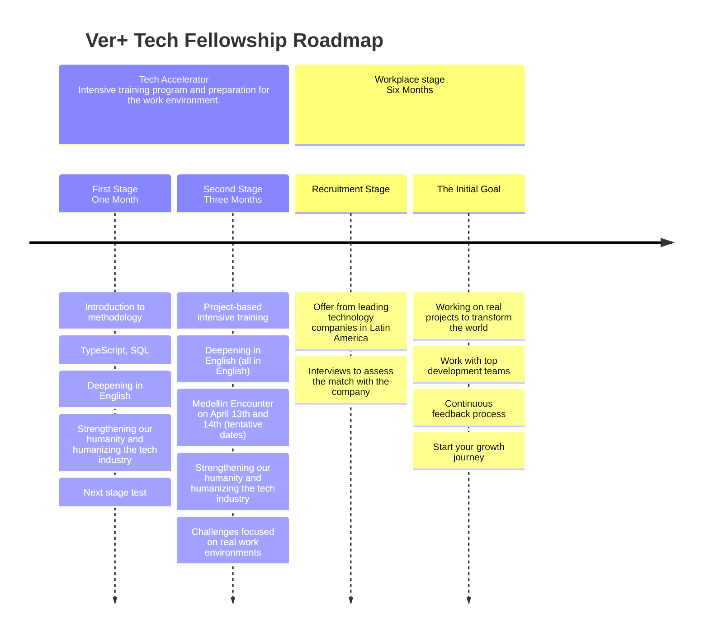

# Ver-TechFellowship
🎓 Path to a self-taught tech accelerator. Be the next Colombian tech leader!

# Ver+Tech-Fellowship
Created by [VélezReyes+] philanthropic platform, Ver+ Tech Fellowship is a talent acceleration focused on creating and supporting the next generation of Colombian technological leaders. In Colombia, you can easily predict a child’s future from the very minute they are born. The solution is for every child to access the opportunities to build their own future, a guiding pillar for VélezReyes+. Committed to creating a world with equal access to opportunities, VélezReyes+ made public to all [Ver+ Tech Fellowship] applicants the Fellowship’s curriculum to make it possible for more people to reach their potential in technology and beyond. 

>*More of and more for Latin America*
# Contents
<!--Table of content-->
| Weekly | Main Topic | Link |
| --- | --- | --- |
| Week 0[^1] | TypeScript & SQL | [Here](https://github.com/VelezReyes/Ver-TechFellowship/wiki/Assignments#week-1) |
| Week 1 | TypeScript, Python & Data | [Here](https://github.com/VelezReyes/Ver-TechFellowship/wiki/Assignments#week-2---assignments) |
| Week 2 | Comming soon | Comming soon |
| Week 3 | Comming soon | Comming soon |
| Week 4 | Comming soon | Comming soon |
| Week 5 | Comming soon | Comming soon |
| Week 6 | Comming soon | Comming soon |
| Week 7 | Comming soon | Comming soon |
| Week 8 | Comming soon | Comming soon |
| Week 9 | Comming soon | Comming soon |
| Week 10 | Comming soon | Comming soon |

# What You Should Expect
We will weekly update this project until the last week of the program. This program is essentially structured towards people who have at least some experience with coding, and throughout the first weeks it will include a lot of Spanish before smoothly transitioning to English-immersed lessons. You are encouraged to use an IDE like Visual Studio Code to complete exercises and future projects; be patient, curious, and enterprising to study the curriculum and find solutions; and cultivate self-discipline and commitment to complete this project. 

While this guide is designed to be self-paced and self-taught, we highly recommend you to set learning goals. Take your time and join us as the next Colombian tech leader.
# Curriculum Roadmap
<!--Roadmap-->

<!-- Footnotes -->
[^1]: Why do we start counting from zero? It turns out that in programming, almost everything starts at 0. [Here for more information].

<!-- Link and resourse-->
[VélezReyes+]: https://velezreyesmas.com/
[Ver+ Tech Fellowship]: https://velezreyesmas.com/fellows/
[Here for more information]: https://en.wikipedia.org/wiki/Zero-based_numbering

